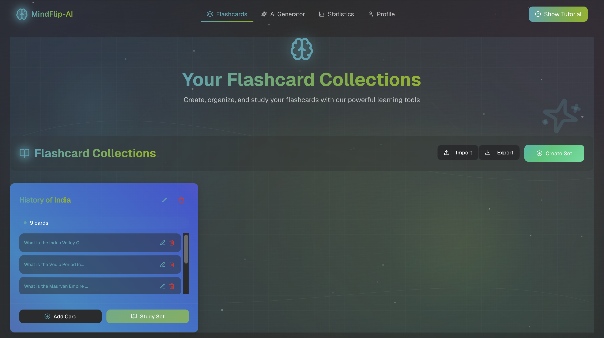
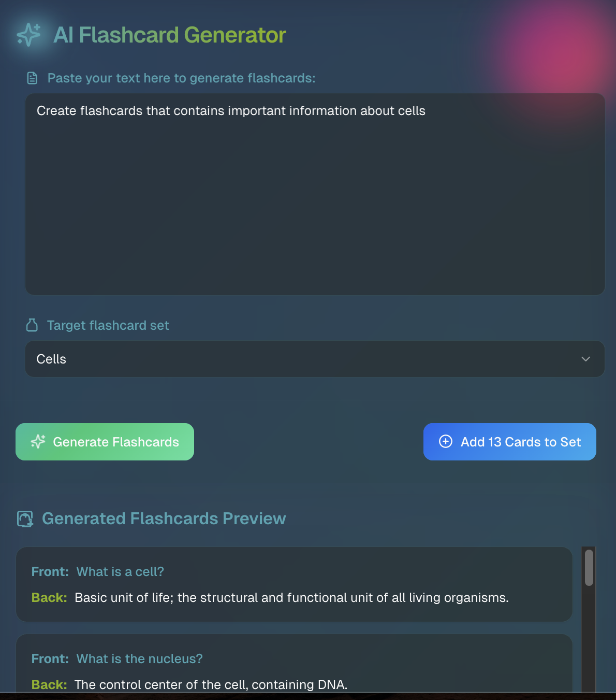
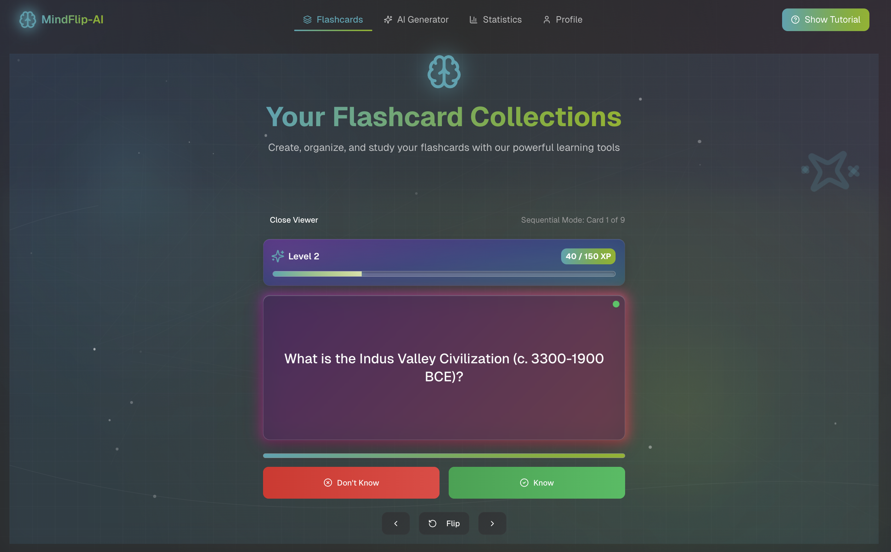
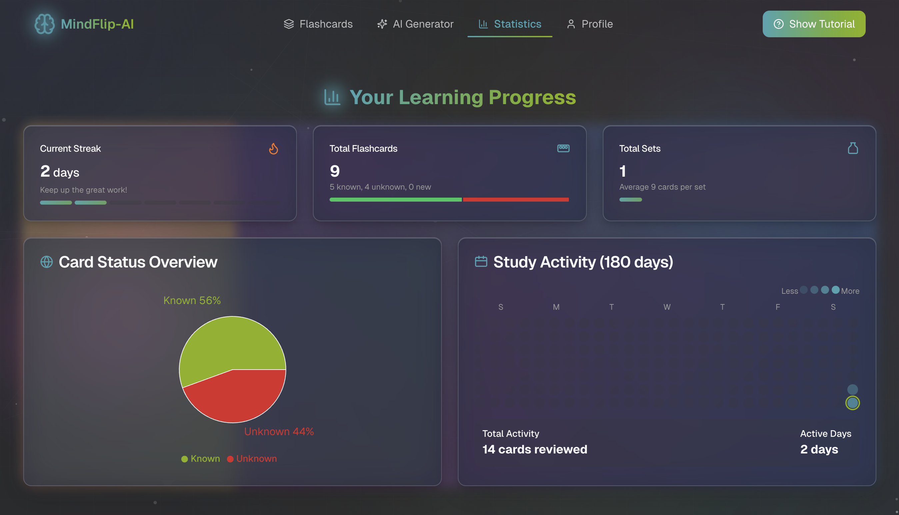
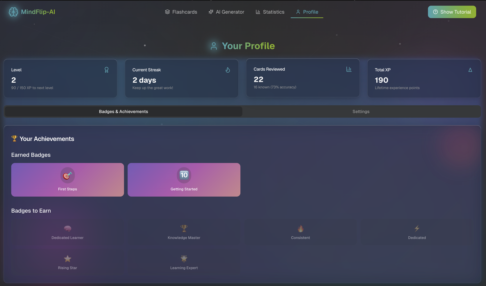

# 🧠 MindFlip — AI-Powered Flashcard Learning Game

MindFlip is an AI-driven flashcard app that transforms the way students learn. With smart repetition, elegant UI, and smooth flow, it’s designed to help users remember better — faster.


---

## ✨ Features

- 🎴 Flip-based flashcards with “Know” / “Don’t Know” interaction
- 🧠 Smart repetition engine powered by AI to boost long-term retention
- 📊 Real-time performance tracking and review insights
- 🔁 Re-attempt incorrect cards until mastery is achieved
- 🌙 Beautiful dark mode support with modern animations
- 📱 Fully responsive across mobile, tablet, and desktop

---

## 🔍 Criteria Alignment

### 🧭 User Experience
- Clear navigation and intuitive card flipping
- Minimal learning curve — instant understanding of how to play
- Fast feedback loop with satisfying animations and response time

### 🎨 Visual Design
- Clean layout with consistent spacing and color system
- Modern aesthetics: gradients, glassmorphism, and subtle shadows
- Fully responsive layout with smooth transitions

### ⚙️ Functionality
- No broken UI or logical flow — every feature works as intended
- State tracking for learning progress and retry logic
- Adaptive review deck based on user input

### 🧼 Code Quality
- Organized React codebase using components and hooks
- Tailwind CSS utility-first styling for clean implementation
- Reusable logic modules and consistent naming conventions

---

## 🚀 Tech Stack

- **Frontend**: React + Vite
- **Styling**: Tailwind CSS + Framer Motion
- **State Management**: Zustand or Context API
- **AI Logic**: Custom spaced repetition engine
- **Deployment**: Vercel

---

## 📸 Screenshots
| Onboarding View |


| Flashcardset view |


| AI Generator view |


| Cards view |


| Statistics view |


|Profile view |


---

## 📂 Folder Structure

```
MindFlip-AI/
├── src/
│   ├── ai/               # AI-related logic
│   ├── app/              # Main App pages
│   ├── components/       # Reusable UI components
│   ├── contexts/         # Context providers
│   ├── hooks/            # Custom React hooks
│   ├── lib/              # Utility functions
│   └── store/            # Global store setup
├── tailwind.config.ts
├── next.config.js / .ts
├── vercel.json
├── package.json
├── README.md
└── tsconfig.json
```

---

## 🛠️ Getting Started

To run this project locally:

### 1. Clone the repository

```bash
git clone https://github.com/arpit15006/MindFlip-AI.git
cd MindFlip-AI
```

### 2. Install dependencies

```bash
npm install
```

### 3. Start the development server

```bash
npm run dev
```

### 4. Build for production

```bash
npm run build
```
## 🤝 Developer

Made with 💙 by Arpit Patel

## 🌐 Live Demo

Check it out live: [Vercel Deployed Link](https://mind-flip-ai.vercel.app)
